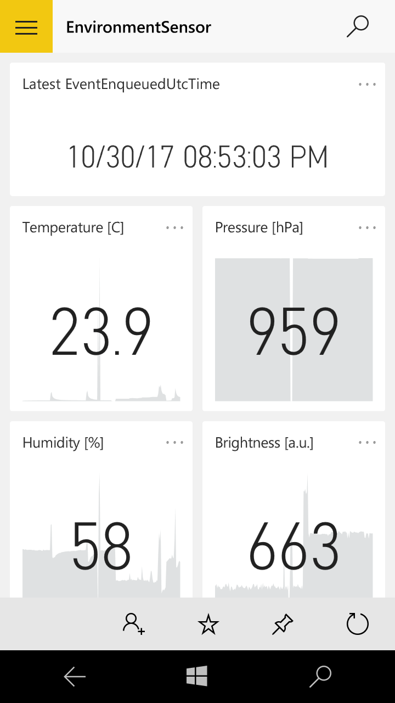

# Motivation

I believe that the _internet of things (IoT)_ and _artificial intelligence (AI)_ will soon empower humans to quickly take informed decisions in any situation. While AI boosts the decision making, IoT plays a key role in understanding the context.

This technological convergence got me excited, and I decided to explore what it takes to implement and end-to-end IoT solution. I followed the [Microsoft DEV225x: Developing IoT Solutions with Azure IoT](https://www.edx.org/course/developing-iot-solutions-azure-iot-microsoft-dev225x-0) course and at the outcome of this endeavor stands a cloud-connected weather station.


The project combines many interesting technologies - electronics, embedded programming, cloud services and mobile apps - into a practical IoT solution without requiring a great deal of deep knowledge in any single area.

# Architecture

Let us briefly explore the building blocks of this IoT solution.

## Payload

The payload breadboard holds:

* *Brightness Sensor* An [RC lowpass filter](https://en.wikipedia.org/wiki/Low-pass_filter) with a [light-sensitive resistor](https://cdn.sparkfun.com/datasheets/Sensors/LightImaging/SEN-09088.pdf) enables the device to measure the RC time-constant and thus extrapolate the ambient light.

* *Temperature Sensor* The [BME280](https://cdn-shop.adafruit.com/datasheets/BST-BME280_DS001-10.pdf) sitting on the [breakout](https://learn.adafruit.com/adafruit-bme280-humidity-barometric-pressure-temperature-sensor-breakout)
senses the ambient temperature. It communicates with the device via an [I2C](https://en.wikipedia.org/wiki/I%C2%B2C) bus.

* *Pressure Sensor* Pressure too is sensed by the BME280.

* *Humidity Sensor* Humidity too is sensed by the BME280.

* *LEDs* Driven in series with a resistor, the LEDs offer a visual representation of the payload's status.

## Device

The payload is connected to a [Raspberry Pi 3 Model B](https://www.raspberrypi.org/products/raspberry-pi-3-model-b/) as shown below. The pi is running [Raspbian 4.9](https://www.raspberrypi.org/downloads/raspbian/), accesses the internet via Wi-Fi and is provided a connection string to the IoT Hub.


## Cloud

I set up an [IoT Hub](https://azure.microsoft.com/en-us/services/iot-hub/) in [Azure](https://azure.microsoft.com/en-us/), Microsoft's cloud computing service. Once registered to the hub, the Pi enjoys secure bi-directional communication with the hub and enters the realm of nearly endless possibilities. In the context of the present project, the messages that the Pi sends to the hub are triaged by a [Stream Analytics](https://azure.microsoft.com/en-us/services/stream-analytics/) job and sinked to [PowerBI](https://powerbi.microsoft.com/en-us/).

## App

Rather than writing an app from scratch to visualize the weather conditions on a mobile device, I created a report and live dashboard with [PowerBI Desktop](https://powerbi.microsoft.com/en-us/desktop/). The dashboard travels with me on my phone that runs the [PowerBI App](https://powerbi.microsoft.com/en-us/mobile/).



# User Guide

Now let me show you how to use this project for your own tinkering.

## Requirements

To use the project as is, you need:

* A Linux environment - Windows users may use the [Windows Subsystem for Linux](https://msdn.microsoft.com/en-us/commandline/wsl/about).

* An Azure account in which you set up an IoT Hub.

* A Raspberry Pi 3 Model B and the payload components listed above. Adafruit offers a more than complete [Microsoft IoT Pack for Raspberry Pi 3](https://www.adafruit.com/product/2733), but you can also run the code on your machine and have it simulate the data (set the _#define SimulatePhotocell_ and _#define SimulateBme280_ flags).

* To visualize the data, you have many options, one being a stream analytics job that triages the data to PowerBI. You find instructions on how to do this in the above links.

## Run the code

* *Locally* To run the code on you development machine, simply install the [Azure IoT SDK](https://launchpad.net/~aziotsdklinux/+archive/ubuntu/ppa-azureiot) and run
```bash
  ./deploy.sh -l
```
* *On the Pi* Recursively clone the [Azure IoT SDK in C](https://github.com/Azure/azure-iot-sdk-c) to your Pi
```bash
    git clone --recursive https://github.com/Azure/azure-iot-sdk-c.git 
```
Tell CMake to compile your project by adding _add_sample_directory(iothub_client_sample_weatherStation)_
towards the end of _CMakeLists.txt_
```bash
    nano azure-iot-sdk-c/iothub_client/samples/CMakeLists.txt
```
Then deploy the code to your Pi
```bash
  ./deploy.sh
```

Once the code runs on the Pi, you will see the green LED blink each time a measurement is taken (about once a minute, but you can easily adjust that). If the blue led shines, then the Pi transmits the data to the hub and it will promptly appear on your dashboard if you configured one.

## Control

You can remotely control the weather station and instruct it to resume or pause transmission of the data to the hub. To do so, you may for instance use the [IoT Hub Explorer](https://docs.microsoft.com/en-us/azure/iot-hub/iot-hub-device-management-iothub-explorer):

* To enable telemetry and switch the blue LED on
```bash
  iothub-explorer device-method <your-device-name> BroadcastWeather [true]
```

* To disable telemetry and switch the blue LED off
```bash
  iothub-explorer device-method <your-device-name> BroadcastWeather [false]
```

## Note

Depending on your subscriptions, some of the listed services may entail costs.
